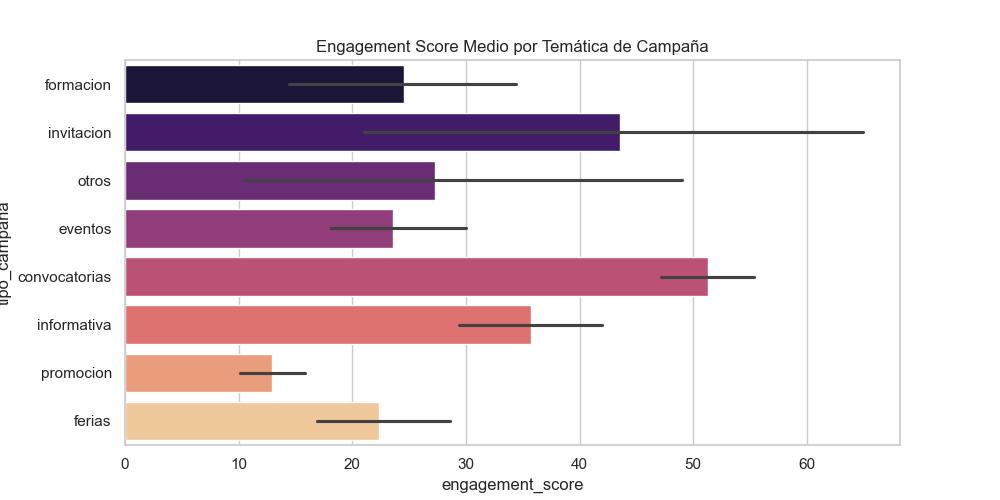

# 🎭 enGira! · Análisis de campañas y estrategia de marketing digital

## 📌 Descripción del proyecto

Este proyecto tiene como objetivo analizar el rendimiento histórico de las campañas de **newsletter enviadas desde el lanzamiento de la plataforma enGira!** para extraer patrones de comportamiento y convertirlos en **insights accionables** que sirvan de base para una futura **campaña de marketing digital multicanal**.

El análisis ahora incluye métricas avanzadas de negocio como el **Engagement Score**, detección de **Outliers de Éxito** y generación de **Recomendaciones Estratégicas Automatizadas**.

---

## 🎯 Objetivos del proyecto

- **Analizar el rendimiento histórico** (2024-2026) de e-mail marketing.
- **Segmentar audiencias** y definir mensajes clave basados en datos reales.
- **Calcular el Engagement Score** combinando Apertura (30%) y Clics (70%).
- **Generar recomendaciones estratégicas** basadas en el análisis de correlación y éxito relativo.

---

## 📈 Resultados y Hallazgos Clave (Actualizado)

Tras procesar y analizar las campañas históricas con el nuevo motor de insights, se han obtenido los siguientes hallazgos:

*   **Engagement Score Promedio:** Herramienta clave para priorizar temáticas.
*   **Correlación Volumen-Apertura:** -0.15 (Indica que el crecimiento de la lista no está penalizando la apertura, permitiendo escalabilidad).

### 🔍 Insights Estratégicos

1.  **Dominio de las Convocatorias:** Siguen siendo el motor del proyecto, liderando el **Engagement Score** y la conversión directa.
2.  **Momento de Envío Óptimo:** Los **Miércoles** se consolidan como el día con mayor equilibrio entre apertura y clics (Engagement máximo).
3.  **Detección de Éxitos Extraordinarios:** Se han identificado campañas que rinden 2 desviaciones estándar por encima de la media en CTR, sirviendo como "Benchmarks" de contenido.
4.  **Brecha de Engagement:** El público **Artistas** mantiene una receptividad muy superior a la de los **Programadores**, quienes requieren una redefinición urgente de la propuesta de valor.

---

## 🖼️ Visualizaciones Destacadas

### 1. Engagement Score por Temática
Nueva métrica que permite identificar qué contenidos generan acción real, no solo curiosidad.


### 2. Mapa de Calor: Temática vs Público


### 3. Eficiencia por Volumen (Correlación)
Visualización de la relación entre el número de envíos y la tasa de apertura para evitar la fatiga de la audiencia.


---

## 🧰 Ejecución del Proyecto

El proyecto está totalmente automatizado a través de un pipeline de datos:

```bash
# Ejecutar el análisis completo y generar informes
python3 pipeline.py
```

Esto ejecutará secuencialmente:
1.  **Limpieza:** `scripts/limpiar_datos.py` (Normalización y mapeo de días).
2.  **Análisis:** `scripts/analisis_insights.py` (Cálculo de métricas y exportación de informes).

---

## 🗂️ Estructura del proyecto

```bash
engira-marketing-analytics/
│
├── pipeline.py                         # Orquestador principal del análisis
├── scripts/
│   ├── limpiar_datos.py                # Lógica de limpieza y normalización
│   ├── analisis_insights.py            # Motor de cálculo de métricas y gráficos
│   └── utils.py                        # Funciones comunes y clasificadores
│
├── notebooks/
│   ├── 04_insights_segmentacion.ipynb  # Laboratorio de experimentación y EDA
│
├── outputs/                            # Resultados generados automáticamente
│   ├── graficos/                       # Visualizaciones en PNG
│   ├── tablas/                         # CSVs (incluye 'campañas_top.csv')
│   └── informes/                       # Recomendaciones estratégicas en TXT 🚀
│
└── data/
    ├── raw/                            # Dataset original (data.csv)
    └── processed/                      # Dataset limpio (data_limpia.csv)
```

---

## 🧠 Segmentación y Propuesta de Valor 

A partir de los hallazgos del análisis, se ha desarrollado una capa estratégica orientada a **traducir los insights en decisiones de negocio y activación de campañas**.

---

### 🎯 Segmentos clave identificados

El comportamiento de las audiencias permite definir tres segmentos principales:

- **Artistas / compañías** → Alto engagement, orientados a oportunidades y recursos prácticos  
- **Programadores/as** → Bajo engagement, requieren una propuesta de valor más específica  
- **Usuarios potenciales** → Leads con interés latente que necesitan activación rápida  

Esta segmentación responde directamente a la brecha detectada en rendimiento entre públicos.

---

### 🔍 Insights de comportamiento por segmento

- **Artistas:**  
  Responden mejor a contenidos de oportunidad inmediata (convocatorias), con alta tasa de apertura y clic.

- **Programadores:**  
  Presentan bajo engagement sostenido, lo que indica un desajuste entre contenido y expectativas.

- **Usuarios potenciales:**  
  Requieren propuestas de valor claras desde el primer contacto para reducir fricción de entrada.

---

### 💡 Propuesta de valor diferenciada

A partir de estos patrones, se redefine la propuesta de valor por segmento:

- **Artistas / compañías**  
  → *“Accede a oportunidades reales y profesionaliza tu carrera con recursos aplicables”*  
  (Convocatorias + recursos + acompañamiento)

- **Programadores/as**  
  → *“Descubre talento emergente seleccionado con criterio, sin perder tiempo”*  
  (Curaduría + eficiencia + calidad)

- **Usuarios potenciales**  
  → *“Empieza con recursos prácticos y oportunidades desde el primer momento”*  
  (Onboarding + valor inmediato)

---

### 📢 Implicaciones en la estrategia de contenido

El análisis demuestra que el rendimiento no depende únicamente del contenido, sino de la **alineación entre contenido, audiencia y objetivo**.

Esto se traduce en:

- **Artistas → Estrategia de volumen + oportunidades**  
  (Convocatorias como núcleo de contenido)

- **Programadores → Estrategia de precisión + curaduría**  
  (Menos impacto masivo, más valor específico)

- **Campañas diferenciadas por objetivo:**  
  - **Conversión** → Convocatorias, invitaciones  
  - **Engagement** → Formación, recursos  
  - **Branding** → Visibilidad, comunidad  

---

### 🚀 Traducción a activación

Estos principios permiten construir una arquitectura de campañas más eficiente, donde:

- Cada campaña responde a un único objetivo
- Cada segmento recibe un mensaje específico
- El contenido se convierte en una herramienta directa de conversión

Este enfoque marca la transición de un análisis descriptivo a una **estrategia de marketing basada en datos y orientada a negocio**.

## 🚀 Próximos Pasos

- **A/B Testing:** Aplicar las recomendaciones de los Miércoles para validar el aumento de CTR.
- **Revisión Programadores:** Rediseñar la estrategia de asuntos para este segmento basándose en el análisis de outliers.
- **Dashboarding:** Conectar los CSVs de `outputs/tablas/` a un panel interactivo.

---

## 👩‍💻 Autora
**Maria Moral** - Especialista en análisis de datos aplicado a la gestión cultural y marketing digital.
