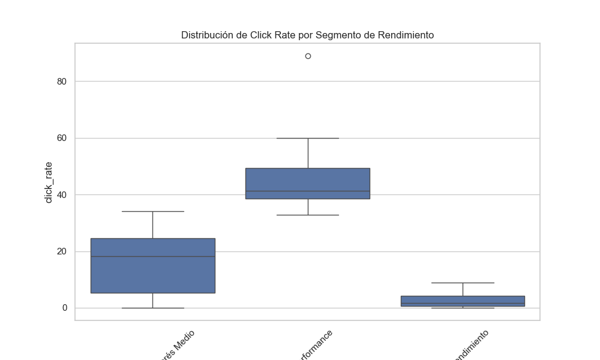
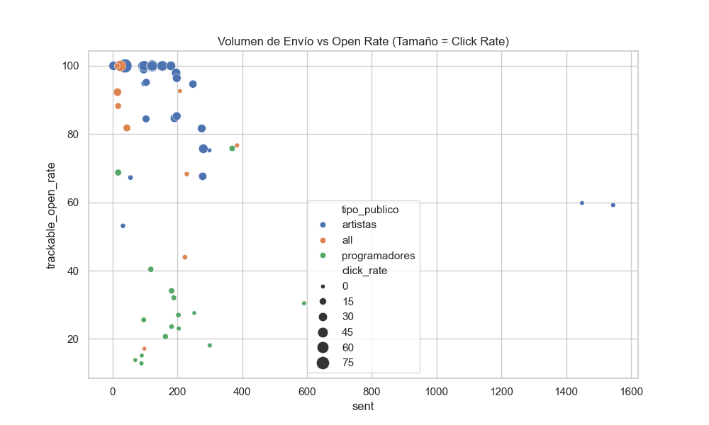

# 🎭 enGira! · Análisis de campañas y estrategia de marketing digital

## 📌 Descripción del proyecto

Este proyecto tiene como objetivo analizar el rendimiento histórico de las campañas de **newsletter enviadas desde el lanzamiento de la plataforma enGira!** para extraer patrones de comportamiento y convertirlos en **insights accionables** que sirvan de base para una futura **campaña de marketing digital multicanal**.

La campaña está orientada a dos grandes públicos (Artistas y Programadores) y busca optimizar la captación de leads y la conversión a programas de acompañamiento profesional.

---

## 🎯 Objetivos del proyecto

- **Analizar el rendimiento histórico** (2024-2026) de e-mail marketing.
- **Segmentar audiencias** y definir mensajes clave basados en datos reales.
- **Diseñar una estrategia multicanal** (Email, Instagram, LinkedIn, Web) alineada con los hallazgos.
- **Establecer un sistema de KPIs** y tracking para la toma de decisiones.

---

## 📈 Resultados y Hallazgos Clave

Tras procesar y analizar más de 50 campañas históricas, se han obtenido los siguientes KPIs generales:

*   **Open Rate (Apertura) Medio:** 68.9%
*   **CTR (Clics) Medio:** 17.7%

### 🔍 Insights Estratégicos

1.  **Efecto "Convocatoria":** Las campañas con temática de convocatorias abiertas son las más exitosas, alcanzando un **Open Rate récord del 92.3%**.
2.  **Brecha de Engagement:** Existe una asimetría crítica entre públicos. Mientras los **Artistas** mantienen un Open Rate medio del **87.9%**, los **Programadores** se sitúan en un **30.6%**. Esto indica la necesidad de personalizar radicalmente los asuntos y contenidos para el sector de programación.
3.  **Temáticas Ganadoras:** Las campañas de formación y recursos prácticos (como el *Toolkit*) generan un interés sostenido, sirviendo como gancho ideal para la conversión a servicios de pago.
4.  **Benchmarks de Éxito:** Se han identificado **12 campañas "Top Performance"** que superan el 80% de apertura y el 30% de clics, las cuales servirán como plantilla para futuras comunicaciones.

---

## 🖼️ Visualizaciones Destacadas

Los análisis se apoyan en visualizaciones clave que permiten entender el comportamiento de los usuarios de un vistazo:

### 1. Mapa de Calor: Temática vs Público
Identifica qué temas "traccionan" mejor para cada segmento. Es fundamental para priorizar el tipo de contenido según la audiencia.


### 2. Distribución de Clics por Segmento
Muestra la variabilidad de la conversión (Click Rate) según el éxito de la campaña. Permite validar los umbrales de "Top Performance".


### 3. Relación Volumen vs Apertura
Analiza si el tamaño del envío (número de destinatarios) afecta a la calidad del engagement (Open Rate), segmentado por tipo de público.


---

## 🧰 Herramientas y tecnologías

- **Python:** `pandas`, `numpy`, `matplotlib`, `seaborn` para limpieza y análisis.
- **Jupyter Notebook:** Para el desarrollo iterativo del EDA e insights.
- **Brevo:** Fuente de datos original.
- **Git & GitHub:** Control de versiones y documentación.

---

## 🗂️ Estructura del proyecto

```bash
engira-marketing-analytics/
│
├── notebooks/
│   ├── 02_limpieza_transformacion.ipynb    # Procesamiento del dataset original
│   ├── 03_eda_newsletters.ipynb            # Análisis exploratorio profundo
│   └── 04_insights_segmentacion.ipynb     # Segmentación y conclusiones
│
├── scripts/
│   ├── analisis_insights.py                # Script de generación de informes y gráficos
│   └── limpieza.py                         # Lógica de limpieza modularizada
│
├── outputs/                                # Resultados del análisis (Ignorado en git)
│   ├── graficos/                           # PNGs de visualizaciones
│   ├── tablas/                             # CSVs de estadísticas agrupadas
│   └── informes/                           # Insights textuales resumidos
│
└── docs/
    ├── diccionario_variables.md            # Definición de métricas y origen
    └── estrategia_marketing.md             # Documento de estrategia multicanal
```

---

## 🚀 Próximos Pasos

- **Automatización:** Implementar secuencias de bienvenida basadas en los contenidos con mayor engagement.
- **LinkedIn Strategy:** Desarrollar contenidos específicos para el sector "Programadores" basados en el insight de baja apertura en email.
- **Dashboarding:** Migrar las visualizaciones estáticas a un panel interactivo en Tableau/Power BI.

---

## 👩‍💻 Autora
**Maria Moral** - Especialista en análisis de datos aplicado a la gestión cultural y marketing digital.
